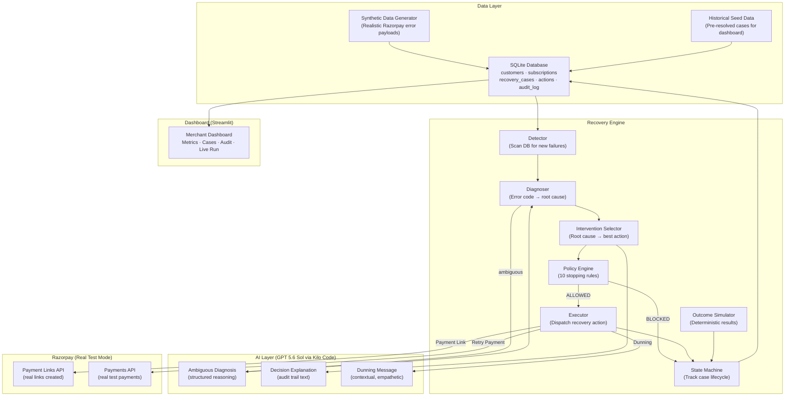
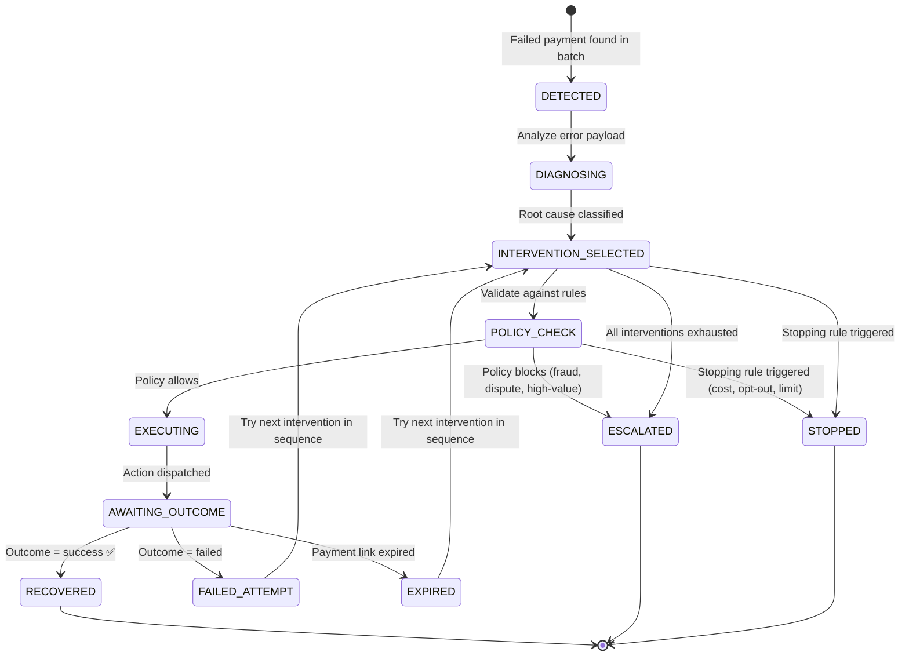

# AI Revenue Recovery — Implementation Plan

## Chosen Recovery Use Case: Failed Subscription Payment Recovery

**What we're building:** A product that a merchant plugs into their Razorpay account. It ingests failed subscription payment events, diagnoses why each payment failed, selects the right recovery action per failure cause, executes recovery via real Razorpay APIs (Payment Links, retries), and tracks ₹ recovered — all autonomously within merchant-defined policy guardrails.

**Why this use case:**

| Criterion | Why it fits |
|---|---|
| **Real product potential** | Every SaaS/subscription merchant on Razorpay loses revenue to failed charges — this tool plugs in and recovers it |
| **Clear revenue at risk** | Each failed charge = ₹ lost. No ambiguity about intent |
| **Multiple root causes** | Insufficient funds, expired card, bank decline, auth required — each needs a different intervention |
| **Razorpay API fit** | Payment Links API + Payments API give us real recovery actions |
| **Clean attribution** | Payment failed → we intervened → payment succeeded. Direct cause-and-effect |
| **Natural state machine** | Subscription billing is inherently stateful — perfect for demonstrating bounded recovery |

---

## 🎯 North Star: The Judging Bar

> [!CAUTION]
> **DO NOT DEVIATE FROM THIS.** Every feature, every UI element, every line of code must serve this bar:
>
> *"Don't just identify the problem. Show measured money recovered across a batch, with compliant escalation, stopping rules, and an audit trail."*

The judges are explicitly looking for **four things** beyond detection. Every one of them must be **clearly visible and understandable** in the dashboard — not buried, not implied, not in a JSON dump.

| Judge Requirement | What They Want to See | Where It Lives in Our UI |
|---|---|---|
| **① Measured Money Recovered** | Not just "we found failures." Concrete ₹ numbers: how much was at risk, how much was recovered, what's the rate, across the FULL batch — not one cherry-picked example. | **Page 1 hero metrics** (₹ at risk, ₹ recovered, rate %), **Recovery Results table** (every case with ₹ outcome), **Recovery by root cause chart** |
| **② Compliant Escalation** | Some cases MUST be handed to humans. Fraud, disputes, high-value — the system must recognize its limits and escalate with context. Judges will look for this specifically. | **Page 2 case table** with 🟠 ESCALATED badges, **Page 3 case detail** showing WHY it was escalated, **Page 1 funnel** showing escalated count, **dedicated Escalation section** on Page 5 |
| **③ Stopping Rules** | The system must know when to STOP — not retry infinitely, not spam customers, not recover ₹35 at ₹50 cost. This proves the system is bounded and safe. | **Page 5 entire page** dedicated to rules + stats, **Page 3 policy card** showing all 10 rules checked per case, **Page 1 funnel** showing stopped count |
| **④ Audit Trail** | Every case: what happened → why → what was chosen → why → was it allowed → what was done → outcome. Full transparency, not a black box. | **Page 3 full-page audit timeline** per case, **expandable raw events**, **AI reasoning visible** for every decision |

> [!IMPORTANT]
> **The dashboard is NOT a nice-to-have visualization layer.** It IS the demo. If a judge can't see measured money, compliant escalation, stopping rules, and audit trails **clearly and intuitively within 30 seconds of looking at the screen**, we have failed — regardless of how good the backend is.
>
> Design every UI section by asking: **"Which of the 4 judging criteria does this serve?"** If it serves none, cut it.

### What This Means in Practice

1. **Don't get distracted building clever AI features** — the judges want to see the recovery LOOP working, not impressive prompts
2. **Don't spend time on features that don't map to the 4 criteria** — no login pages, no settings panels, no fancy onboarding
3. **Every dashboard page must answer a judge's question:**
   - Page 1: *"Did it actually recover money? How much?"* → ① Measured Money
   - Page 2: *"Show me the batch. What happened to each case?"* → ① + ② + ③
   - Page 3: *"Walk me through one case. Why did it do what it did?"* → ④ Audit Trail
   - Page 4: *"Show me it working live."* → The complete loop
   - Page 5: *"How is it bounded? When does it stop? What does it escalate?"* → ② + ③

---

## Design Decisions

### 1. Razorpay Integration: Pragmatic Hybrid

| What | Approach | Why |
|---|---|---|
| **Failure data** | Realistic synthetic cases using Razorpay's actual error code format | Need 9 different failure types — test mode can't produce this variety |
| **Payment Links** | ✅ **Real** Razorpay Payment Links API calls | Proof of real integration, judges can click the links |
| **Payment retries** | ✅ **Real** Razorpay test-mode payment attempts | Shows real API usage |
| **Outcomes** | Deterministic simulator | No real customers exist in test mode to click links |
| **Webhooks** | ❌ Not used as system backbone | Avoids ngrok dependency and demo fragility |

> The system processes cases from the database and calls Razorpay APIs as recovery **actions**. This is robust for demo and production-ready by design — in production, you'd add a webhook listener that feeds cases into the same database.

### 2. AI: GPT 5.6 Sol via Kilo Code

| Detail | Value |
|---|---|
| **Model** | GPT 5.6 Sol |
| **Access method** | Kilo Code extension → local OpenAI-compatible endpoint |
| **Python library** | `openai` with custom `base_url` pointing to localhost |
| **Cost** | ₹0 (uses existing ChatGPT Plus subscription) |
| **Used for** | 3 bounded tasks only: root cause reasoning, intervention explanation, dunning message generation |
| **Not used for** | Detection, policy checks, state transitions, stopping rules (all deterministic Python) |

### 3. Architecture: DB-Driven, Not Webhook-Driven

The system polls/processes cases from SQLite rather than depending on live webhooks. This:
- Eliminates demo fragility (no ngrok, no webhook delays)
- Makes the demo reproducible (same cases → same results every time)
- Is still production-ready (add a webhook listener that writes to the same DB)

---

## Final Tech Stack

| Layer | Technology | Justification |
|---|---|---|
| **Frontend** | Streamlit | Rapid dashboard, no frontend build step |
| **Backend API** | FastAPI (Python) | API endpoints, background task runner |
| **Database** | SQLite via `sqlite3` | Zero infra, sufficient for demo |
| **Data Processing** | Pandas | Aggregate metrics, batch analysis |
| **AI** | GPT 5.6 Sol via Kilo Code (OpenAI-compatible) | Zero cost, strong reasoning, standard `openai` SDK |
| **State Machine** | Python `enum` + SQLite state column | Deterministic, auditable |
| **Charts** | Plotly (via Streamlit) | Interactive visualizations |
| **Payments** | Razorpay Test Mode — Payment Links API, Payments API | Real API calls for recovery actions |

---

## System Architecture



---

## Recovery State Flow



**Terminal states:**
- **`RECOVERED`** — Payment succeeded after intervention. ₹ attributed.
- **`ESCALATED`** — Autonomous recovery inappropriate. Merchant gets full context.
- **`STOPPED`** — Agent stopped trying. Reason: cost exceeded, opt-out, retry limit, or dispute.

---

## Phase-wise Implementation Plan

---

### Phase 1 — Foundation: Database, Models, Config & Razorpay Client

**Goal:** Set up the database schema, data models, configuration, Razorpay SDK connection, and LLM client. Verify Razorpay Payment Link creation works in test mode.

**What to build:**
- SQLite schema for the full data model
- Pydantic models and enums
- Razorpay Python SDK connection (test mode)
- LLM client via `openai` library pointed at Kilo Code
- Configuration management

**Backend work:**

- `config.py` — Configuration:
  ```
  RAZORPAY_KEY_ID          # test mode key
  RAZORPAY_KEY_SECRET      # test mode secret
  LLM_BASE_URL             # Kilo Code local endpoint (e.g., http://localhost:XXXX/v1)
  LLM_API_KEY              # Kilo Code key
  LLM_MODEL                # gpt-5.6-sol or model identifier
  DATABASE_PATH             # SQLite file path
  # Policy thresholds
  MAX_RETRY_ATTEMPTS = 3
  MAX_COMMUNICATIONS = 2
  MAX_RECOVERY_DAYS = 14
  MIN_RECOVERY_AMOUNT = 50  # ₹
  COST_RATIO_LIMIT = 0.30
  COOLDOWN_HOURS = 24
  HIGH_VALUE_THRESHOLD = 25000  # ₹
  ```

- `database/schema.sql`:
  ```sql
  customers (
    id TEXT PRIMARY KEY,
    name TEXT, email TEXT, phone TEXT,
    created_at TEXT, opt_out BOOLEAN DEFAULT 0
  )

  subscriptions (
    id TEXT PRIMARY KEY,
    customer_id TEXT REFERENCES customers(id),
    plan_name TEXT, amount INTEGER,  -- in paise
    currency TEXT DEFAULT 'INR',
    billing_cycle TEXT,  -- monthly/yearly
    remaining_cycles INTEGER,
    status TEXT,
    created_at TEXT
  )

  recovery_cases (
    id TEXT PRIMARY KEY,
    subscription_id TEXT REFERENCES subscriptions(id),
    razorpay_payment_id TEXT,    -- from error payload
    failure_error_code TEXT,
    failure_error_description TEXT,
    failure_error_reason TEXT,
    failure_error_source TEXT,
    amount_at_risk INTEGER,      -- paise
    root_cause TEXT,              -- enum value
    current_intervention TEXT,    -- enum value
    status TEXT,                  -- state machine
    attempt_count INTEGER DEFAULT 0,
    communication_count INTEGER DEFAULT 0,
    created_at TEXT,
    updated_at TEXT,
    resolved_at TEXT,
    amount_recovered INTEGER DEFAULT 0,
    razorpay_payment_link_id TEXT,
    razorpay_payment_link_url TEXT,
    escalation_reason TEXT,
    stop_reason TEXT
  )

  recovery_actions (
    id TEXT PRIMARY KEY,
    case_id TEXT REFERENCES recovery_cases(id),
    action_type TEXT,
    action_details TEXT,       -- JSON
    razorpay_response TEXT,    -- JSON (real API response)
    outcome TEXT,
    created_at TEXT
  )

  audit_log (
    id TEXT PRIMARY KEY,
    case_id TEXT REFERENCES recovery_cases(id),
    timestamp TEXT,
    event_type TEXT,
    actor TEXT,    -- SYSTEM / AI / RAZORPAY / POLICY_ENGINE
    details TEXT,  -- JSON
    reasoning TEXT  -- human-readable explanation
  )
  ```

- `database/db.py` — Connection helper, query functions, migration runner

- `models/enums.py`:
  - `RootCause`: INSUFFICIENT_FUNDS, EXPIRED_CARD, BANK_DECLINE, AUTH_REQUIRED, NETWORK_ERROR, ACCOUNT_CLOSED, INTERNATIONAL_RESTRICTION, FRAUD_FLAG, DISPUTED
  - `RecoveryStatus`: DETECTED, DIAGNOSING, INTERVENTION_SELECTED, POLICY_CHECK, EXECUTING, AWAITING_OUTCOME, RECOVERED, ESCALATED, STOPPED
  - `ActionType`: SMART_RETRY, PAYMENT_LINK, DUNNING_MESSAGE, ESCALATION
  - `PolicyResult`: ALLOWED, BLOCKED, ESCALATE, STOP

- `models/schemas.py` — Pydantic models for Customer, Subscription, RecoveryCase, RecoveryAction, AuditEntry

- `razorpay_client.py`:
  - Initialize Razorpay SDK with test keys
  - `create_payment_link(amount_paise, customer_name, customer_email, customer_phone, description, expiry_days)` → returns link URL + link ID
  - `create_payment(amount_paise, ...)` → attempt a test payment
  - `fetch_payment(payment_id)` → get payment status

- `ai/llm.py`:
  ```python
  from openai import OpenAI

  client = OpenAI(
      base_url=config.LLM_BASE_URL,   # Kilo Code endpoint
      api_key=config.LLM_API_KEY
  )

  def diagnose_ambiguous(error_payload, payment_history) -> dict:
      """Returns {root_cause, confidence, reasoning}"""

  def explain_intervention(root_cause, selected_action, alternatives) -> str:
      """Returns human-readable explanation for audit trail"""

  def generate_dunning_message(customer_name, amount, plan_name,
                                failure_reason, attempt_number,
                                payment_link_url) -> str:
      """Returns contextual, empathetic recovery message"""
  ```

**Frontend work:** None.

**AI role:** Set up client, test with a simple call.

**Testing:**
- Create one Razorpay Payment Link in test mode → verify it returns a real URL
- Send one prompt to Kilo Code endpoint → verify response
- Create tables in SQLite → verify schema
- Insert/query test data

**Definition of Done:**
- ✅ Razorpay SDK connected, can create Payment Links in test mode
- ✅ LLM client works via Kilo Code endpoint
- ✅ SQLite schema created, CRUD operations work
- ✅ All enums and Pydantic models defined
- ✅ Config loads from `.env` file

---

### Phase 2 — Synthetic Data Generator

**Goal:** Generate a realistic batch of 50-80 failed subscription payment cases with varied failure types, amounts, and customer profiles — formatted to match real Razorpay error payloads.

**What to build:**
- Customer and subscription generator
- Failed payment event generator (realistic Razorpay error payloads)
- Historical resolved cases for dashboard context

**Backend work:**

- `data/generate_batch.py`:

  **Step 1: Create Customers (40-50)**
  - Realistic Indian names, emails, phone numbers
  - 3-4 flagged as `opt_out = True` (for policy testing)
  - Varied account ages (1 month to 3 years)

  **Step 2: Create Subscriptions**
  - Each customer has 1 subscription
  - Plans distributed across tiers:
    - Starter ₹199/mo: 8 subscriptions
    - Basic ₹499/mo: 10 subscriptions
    - Pro ₹999/mo: 8 subscriptions
    - Business ₹2,999/mo: 7 subscriptions
    - Enterprise ₹9,999/mo: 5 subscriptions
    - Premium ₹24,999/mo: 2 subscriptions (tests high-value escalation)
  - One ₹35/mo case (tests minimum amount stopping rule)
  - Remaining cycles: 1-11 (for revenue-at-risk calculation)

  **Step 3: Create Failed Payment Events**
  - Each case gets a failure payload matching Razorpay's actual error format:
    ```json
    {
      "error_code": "BAD_REQUEST_ERROR",
      "error_description": "Your payment didn't go through as it was declined by the bank...",
      "error_reason": "insufficient_funds",
      "error_source": "bank",
      "error_step": "payment_authorization"
    }
    ```
  - **Distribution (50 cases total):**

    | Root Cause | Count | Error Code | Error Reason | Expected Outcome |
    |---|---|---|---|---|
    | Insufficient Funds | 12 | BAD_REQUEST_ERROR | insufficient_funds | ~40% recover |
    | Expired Card | 8 | BAD_REQUEST_ERROR | card_expired | ~50% recover via link |
    | Bank Decline | 7 | GATEWAY_ERROR | payment_declined | ~35% recover |
    | Auth Required | 5 | BAD_REQUEST_ERROR | payment_requires_action | ~60% recover via link |
    | Network Error | 5 | GATEWAY_ERROR | request_timeout | ~85% recover via retry |
    | Account Closed | 5 | BAD_REQUEST_ERROR | account_closed | 0% → escalate |
    | Intl. Restriction | 3 | BAD_REQUEST_ERROR | international_transaction_not_allowed | ~25% |
    | Fraud Flag | 3 | BAD_REQUEST_ERROR | suspected_fraud | 0% → escalate |
    | Disputed | 2 | BAD_REQUEST_ERROR | payment_disputed | 0% → stop |

- `data/seed_historical.py`:
  - Pre-load 30 already-resolved historical cases:
    - 12 recovered (with complete audit trails)
    - 8 escalated
    - 5 stopped
    - 5 unrecovered
  - Each has full audit trail written (so dashboard looks like a running product)
  - Dates spread over past 30 days

**Frontend work:** None.

**AI role:** None. Pure data engineering.

**Testing:**
- Run generator → verify 50 cases in DB
- Verify failure type distribution matches target
- Verify error payloads match Razorpay's actual format
- Verify historical cases have complete audit trails
- Verify edge cases exist: opt-out customer, ₹35 subscription, ₹24,999 subscription

**Definition of Done:**
- ✅ 50 active cases with realistic variety in SQLite
- ✅ 30 historical cases with complete audit trails
- ✅ Error payloads match real Razorpay format
- ✅ Edge cases present for all stopping rules
- ✅ Generator is seeded for reproducible output

---

### Phase 3 — Detection & Root Cause Diagnosis Engine

**Goal:** Scan the database for unprocessed failed payments, classify each failure's root cause, and calculate revenue at risk.

**What to build:**
- Detection scanner
- Root cause classifier (deterministic + AI fallback)
- Revenue-at-risk calculator

**Backend work:**

- `engine/detector.py`:
  - `detect_new_cases()`:
    - Query `recovery_cases WHERE status = 'DETECTED'`
    - For each, calculate revenue at risk: `amount × remaining_cycles`
    - Log `CASE_CREATED` to audit trail
    - Return list of cases to process

- `engine/diagnoser.py`:
  - `diagnose(case) → (root_cause, confidence, reasoning)`:
  - **Deterministic path (~80% of cases):**
    - Lookup table mapping `(error_code, error_reason, error_source)` → `RootCause`
    - Confidence: 1.0
    - Reasoning: `"Deterministic match: error_reason={error_reason}"`

  - **AI-augmented path (~20% of cases):**
    - Triggered when: error_reason is ambiguous, or compound errors, or unmapped codes
    - Call `llm.diagnose_ambiguous(error_payload, payment_history)`
    - Structured output: `{root_cause, confidence, reasoning}`
    - If confidence < 0.7 → default to ESCALATE (conservative)

  - Log `ROOT_CAUSE_DIAGNOSED` to audit trail with method + reasoning

- Revenue-at-risk calculation:
  ```python
  revenue_at_risk = subscription_amount * remaining_cycles
  # Also store immediate_amount = subscription_amount (this cycle)
  ```

**Frontend work:** None.

**AI role:**
- GPT 5.6 Sol called only for ambiguous cases
- Prompt includes: error payload, customer history, subscription details
- Returns structured JSON — root cause enum, confidence score, human-readable reasoning

**Testing:**
- Process all 50 cases → each gets a root cause
- Verify deterministic mapping covers expected cases
- Verify AI is called only for ambiguous cases (not all 50)
- Verify revenue-at-risk math is correct
- Verify audit trail entries created

**Definition of Done:**
- ✅ All 50 cases detected and diagnosed
- ✅ Root cause assigned with confidence and reasoning
- ✅ Revenue at risk calculated per case and aggregate
- ✅ Audit trail captures detection + diagnosis for every case

---

### Phase 4 — Policy Engine, Intervention Selection & Recovery Execution

**Goal:** For each diagnosed case, select the right intervention, check against policy, execute the recovery action (including real Razorpay API calls), simulate outcomes, and handle state transitions.

> [!IMPORTANT]
> This is the heaviest and most critical phase — the core product logic. Do not rush this to get to the dashboard.

**What to build:**
- Intervention selection matrix
- Policy engine with 10 stopping rules
- Recovery executor (real Razorpay API calls + dunning)
- Outcome simulator
- State machine

**Backend work:**

- `engine/intervention_selector.py`:
  - **Root cause → ordered intervention sequence:**

    | Root Cause | 1st Action | 2nd Action | 3rd Action | Fallback |
    |---|---|---|---|---|
    | INSUFFICIENT_FUNDS | Smart retry (3-day delay) | Payment link (7-day expiry) | Dunning message | Escalate |
    | EXPIRED_CARD | Payment link (update card) | Dunning message | — | Escalate |
    | BANK_DECLINE | Smart retry (next day) | Smart retry (different time) | Payment link | Escalate |
    | AUTH_REQUIRED | Payment link (complete auth) | Dunning message | — | Escalate |
    | NETWORK_ERROR | Immediate retry | Smart retry (1hr) | — | Escalate |
    | ACCOUNT_CLOSED | — | — | — | **Escalate immediately** |
    | INTL_RESTRICTION | Dunning (suggest domestic card) | — | — | Escalate |
    | FRAUD_FLAG | — | — | — | **Escalate immediately** |
    | DISPUTED | — | — | — | **Stop immediately** |

  - Tracks which interventions have been tried per case → advances to next
  - Calls `llm.explain_intervention()` for audit trail reasoning

- `engine/policy_engine.py`:

  | # | Rule | Threshold | Returns |
  |---|---|---|---|
  | 1 | Max retry attempts | 3 per case | STOP retrying |
  | 2 | Max communications | 2 per case | STOP messaging |
  | 3 | Max recovery window | 14 days | STOP all |
  | 4 | Minimum viable amount | ₹50 | STOP |
  | 5 | Cost ratio limit | Cost ≤ 30% of amount | STOP |
  | 6 | Customer opt-out | Immediate | STOP |
  | 7 | Action cooldown | 24 hours | WAIT |
  | 8 | Fraud block | Always | ESCALATE |
  | 9 | Dispute block | Always | STOP |
  | 10 | High-value review | ₹25,000+ | ESCALATE |

  - `check_policy(case, proposed_action) → PolicyResult`
  - Returns: `ALLOWED`, `BLOCKED(reason)`, `ESCALATE(reason)`, `STOP(reason)`
  - Logs `POLICY_EVALUATED` to audit with all 10 rules checked and results

- `engine/executor.py`:
  - `execute_action(case, action_type)`:

  - **Smart Retry:**
    - Call `razorpay_client.create_payment()` in test mode
    - Log real Razorpay API response to audit trail
    - Record action in `recovery_actions` table

  - **Payment Link:** ← *Real Razorpay API call*
    - Call `razorpay_client.create_payment_link()`:
      - Real amount, real customer details, real expiry
      - Returns real `plink_XXXX` ID and `https://rzp.io/i/XXXX` URL
    - Store link ID and URL on the case record
    - Log full Razorpay response to audit trail

  - **Dunning Message:**
    - Call `llm.generate_dunning_message()` with:
      - Customer name, amount (₹), plan name
      - Failure reason (human-readable)
      - Attempt number (1st vs 2nd — tone changes)
      - Payment link URL (if created)
    - Log generated message to audit trail
    - Increment `communication_count`

  - **Escalation:**
    - Create escalation record with full context
    - Log reason and recommended merchant action
    - Set status to ESCALATED

- `engine/outcome_simulator.py`:
  - **Deterministic outcomes** (seeded random for reproducibility):

    | Root Cause + Action | Success Rate |
    |---|---|
    | NETWORK_ERROR + immediate retry | 85% |
    | INSUFFICIENT_FUNDS + smart retry | 40% |
    | INSUFFICIENT_FUNDS + payment link | 30% |
    | EXPIRED_CARD + payment link | 50% |
    | AUTH_REQUIRED + payment link | 60% |
    | BANK_DECLINE + retry | 35% |
    | Dunning after failed action | +15% incremental |
    | 2nd retry after 1st failed | 50% of base rate |

  - Pre-determined per case (seeded with case ID) for consistent demo
  - Returns: `SUCCESS` or `FAILURE`
  - On SUCCESS: marks case RECOVERED, records amount
  - On FAILURE: advances to next intervention or terminal state

- `engine/state_machine.py`:
  - `transition(case, event) → new_status`
  - Valid transitions enforced
  - Every transition logged to audit
  - `get_valid_transitions(current_status) → [list]`

- `engine/recovery_orchestrator.py`:
  - **Main orchestration loop** — processes one case through the full pipeline:
    ```python
    def process_case(case):
        # 1. Diagnose
        root_cause = diagnoser.diagnose(case)
        # 2. Select intervention
        action = intervention_selector.select(case, root_cause)
        # 3. Policy check
        policy_result = policy_engine.check(case, action)
        # 4. Execute or terminate
        if policy_result == ALLOWED:
            executor.execute(case, action)
            outcome = outcome_simulator.simulate(case, action)
            if outcome == SUCCESS:
                state_machine.transition(case, RECOVERED)
            else:
                # Try next intervention or escalate
                ...
        elif policy_result == ESCALATE:
            executor.escalate(case, policy_result.reason)
        elif policy_result == STOP:
            state_machine.transition(case, STOPPED)
    ```
  - `process_batch()` — process all pending cases

**Frontend work:** None yet.

**AI role:**
- Explain intervention choice for audit trail
- Generate dunning messages (contextual, varied by attempt/reason/amount)
- Example dunning outputs:
  - 1st attempt, ₹499, insufficient funds: *"Hi Rahul, your ₹499 Basic Plan payment didn't go through — looks like a temporary issue. Here's a quick link to complete it: https://rzp.io/i/abc123. Takes 30 seconds!"*
  - 2nd attempt, ₹2,999, expired card: *"Hi Priya, your card on file has expired, and your Pro Plan (₹2,999/mo) is paused. Update your payment method here to keep your access: https://rzp.io/i/def456"*

**Testing:**
- Process all 50 cases through full pipeline
- Verify real Payment Links created in Razorpay test dashboard
- Verify policy blocks fraud (3 cases) and dispute (2 cases) correctly
- Verify ₹35 case stopped by minimum amount rule
- Verify ₹24,999 cases escalated by high-value rule
- Verify opt-out customers stopped immediately
- Verify dunning messages include real payment link URLs
- Verify expected outcome distribution (~30-40% recovered)

**Definition of Done:**
- ✅ Full pipeline works: detect → diagnose → select → policy → execute → outcome
- ✅ Real Razorpay Payment Links created (with clickable URLs)
- ✅ Policy engine blocks/stops/escalates correctly for all 10 rules
- ✅ AI dunning messages are contextual and varied
- ✅ State machine tracks every case to terminal state
- ✅ ~18-20 recovered, ~15 escalated, ~8 stopped, ~7 unrecovered (approximate)

---

### Phase 5 — Audit Trail & Recovery Attribution

**Goal:** Ensure every case has a complete, inspectable audit trail and implement honest recovery attribution.

**What to build:**
- Audit trail query and formatting
- Recovery attribution logic
- API endpoints for dashboard

**Backend work:**

- `engine/audit.py`:
  - `log_event(case_id, event_type, actor, details, reasoning)`:
    - Writes to `audit_log` table
    - `details` = JSON with full payload (error data, API response, AI output, policy evaluation)
    - `reasoning` = human-readable one-liner
  - Event types:
    - `CASE_CREATED` — failure detected, ₹ at risk calculated
    - `ROOT_CAUSE_DIAGNOSED` — classification + method + reasoning
    - `INTERVENTION_SELECTED` — action + alternatives + AI explanation
    - `POLICY_EVALUATED` — all 10 rules checked, result, which triggered
    - `ACTION_EXECUTED` — action type, Razorpay API response (if applicable)
    - `PAYMENT_LINK_CREATED` — link ID, URL, amount, expiry
    - `DUNNING_GENERATED` — full AI-generated message text
    - `OUTCOME_OBSERVED` — success/failure, amount
    - `STATE_CHANGED` — from → to
    - `CASE_RECOVERED` — amount, attribution
    - `CASE_ESCALATED` — reason, context
    - `CASE_STOPPED` — which rule, why

- `engine/attribution.py`:
  - **Conservative attribution rules:**
    - ✅ Count: Payment succeeded after our retry action
    - ✅ Count: Customer paid via our Payment Link (traceable via link ID)
    - ✅ Count: Customer paid after our dunning message
    - ❌ Don't count: Escalated cases where merchant resolved manually
    - ❌ Don't count: Cases that were stopped
  - Each case records `amount_recovered` (attributed) separately

- `api/routes.py` (FastAPI):
  - `GET /api/cases` — All cases, filterable by status/root_cause/amount
  - `GET /api/cases/{id}` — Full case detail with audit timeline
  - `GET /api/metrics/summary` — Hero metrics (at risk, recovered, rate)
  - `GET /api/metrics/by-root-cause` — Recovery grouped by failure type
  - `GET /api/metrics/by-intervention` — Recovery grouped by action type
  - `GET /api/metrics/funnel` — Case flow through states
  - `GET /api/activity/recent` — Recent audit events (live feed)
  - `POST /api/recovery/process` — Trigger batch processing

**Frontend work:** None.

**AI role:** None. Deterministic logic.

**Testing:**
- Inspect 5 cases: verify audit trail captures every step
- Verify each case has ≥5 audit entries (created → diagnosed → selected → policy → executed → outcome)
- Verify attribution math: sum of recovered amounts = total reported
- Verify API responses match database state

**Definition of Done:**
- ✅ Every case has complete audit trail from detection to terminal state
- ✅ Attribution is conservative and verifiable
- ✅ API endpoints serve all data needed for dashboard
- ✅ Can answer "what happened and why" for any case

---

### Phase 6 — Streamlit Dashboard

**Goal:** Build the merchant-facing dashboard that makes the **four judging criteria** (measured money, compliant escalation, stopping rules, audit trail) **immediately visible and understandable**.

> [!IMPORTANT]
> Every page must directly serve at least one of the four judging criteria. The dashboard IS the demo — if judges can't see the four things clearly within 30 seconds, the backend doesn't matter.

**What to build:**
- 5-page Streamlit dashboard
- Each page mapped to specific judging criteria
- Real-time processing view for live demo

**Frontend work (`dashboard/app.py`):**

- **Page 1: Recovery Command Center** → Serves: **① Measured Money**

  This is the first thing judges see. It must answer: *"Did it actually recover money? How much?"*

  - **Hero metric cards** (large, impossible to miss):
    - 💰 **₹ Revenue at Risk** — total across all cases
    - ✅ **₹ Revenue Recovered** — total attributed recovered
    - 📈 **Recovery Rate %** — (recovered / at risk) × 100
    - 📊 **Cases Processed** — total batch count
  - **Recovery Results Summary** — clear box showing:
    - `XX cases recovered | XX escalated | XX stopped | XX unrecovered`
    - Each with ₹ amounts, not just counts
  - **Recovery funnel** (Plotly Sankey or funnel chart):
    ```
    Detected (80) → Diagnosed → Policy Allowed → Executed →
      → RECOVERED (XX cases, ₹XX,XXX) ✅
      → ESCALATED (XX cases, ₹XX,XXX) ⚠️
      → STOPPED (XX cases, ₹XX,XXX) 🛑
    ```
    This funnel shows judges in one glance that we don't just detect — we close the loop with varied outcomes.
  - **Recovery by Root Cause** (bar chart) — shows different failure types have different recovery rates. Proves we're not applying one-size-fits-all.
  - **Live activity feed** — scrolling list of recent events:
    - "✅ Recovered ₹2,999 from Priya Sharma via payment link"
    - "⚠️ Escalated: fraud flagged on ₹9,999 — handed to merchant"
    - "🛑 Stopped: ₹35 below minimum recovery amount — not worth pursuing"

- **Page 2: Recovery Batch (Case Explorer)** → Serves: **① Measured Money + ② Escalation + ③ Stopping**

  Judges want to see the FULL batch, not cherry-picked examples.

  - Filterable, sortable table of ALL cases (50 active + 30 historical)
  - Filters: Status (multi-select), Root Cause, Amount Range
  - Columns: Case ID | Customer | Plan | ₹ Amount | Root Cause | Action Taken | Status | ₹ Recovered
  - **Color-coded status badges** (instantly scannable):
    - 🟢 RECOVERED — with ₹ amount shown
    - 🟠 ESCALATED — with reason preview ("fraud flagged", "high value")
    - 🔴 STOPPED — with rule that stopped it ("below ₹50 min", "opt-out")
    - ⚪ UNRECOVERED — with what was tried
  - **Batch summary bar** above the table:
    - "Showing 80 cases | 28 recovered (₹1,45,000) | 20 escalated | 10 stopped | 6 unrecovered"
  - Click any row → opens Page 3 for that case

- **Page 3: Case Audit Trail (Deep Dive)** → Serves: **④ Audit Trail** (PRIMARY)

  This is where judges verify the system is transparent and explainable. MOST IMPORTANT PAGE for credibility.

  - **Case Header**: Customer name, plan, ₹ at risk, current status badge
  - **Visual Audit Timeline** — chronological, step-by-step, human-readable:
    Each step shows:
    1. 🔍 **What happened**: "Payment of ₹2,999 failed"
    2. 🧠 **Why revenue is at risk**: "Error: insufficient_funds from bank"
    3. 🎯 **What intervention was selected**: "Smart Retry → Payment Link → Dunning"
    4. 💡 **Why it was selected**: AI explanation — "Insufficient funds often resolves after payday..."
    5. 🛡️ **Whether policy allowed it**: All 10 rules shown as ✓/✗ checklist
    6. ⚡ **What action was taken**: "Created Payment Link plink_XXX — rzp.io/i/XXX"
    7. 📊 **Final outcome**: "₹2,999 recovered via payment link" or "Escalated: fraud detected"
    8. 💰 **Amount recovered**: "₹2,999 attributed"

  - **Each audit step is expandable** — shows raw details (API response, AI prompt/output, policy evaluation JSON)
  - **Dunning message preview** — show the actual AI-generated message text
  - **Razorpay links are clickable** — proves real API integration

  > The judge should be able to point at ANY case and get a full, honest explanation of every decision the system made.

- **Page 4: Live Recovery Engine** → Serves: **THE COMPLETE LOOP** (Demo page)

  This is the live demo moment. Judges watch the system work.

  - **"🚀 Run Recovery Engine"** button
  - When clicked:
    - Processes all DETECTED cases through full pipeline
    - **Real-time log** showing each case as it's processed:
      - "Diagnosing RC-042... root cause: INSUFFICIENT_FUNDS"
      - "Selecting intervention... Smart Retry (1st of 3)"
      - "Policy check... ✅ ALLOWED (all 10 rules pass)"
      - "Executing... Payment link created: rzp.io/i/abc123"
    - Live-updating summary counters at the top
  - **"🎲 Simulate Customer Responses"** button (after processing):
    - Runs outcome simulator to close the loop
    - Cases flip to terminal states with live animation
    - ₹ recovered counter ticks up in real-time
  - **Final summary box**:
    ```
    ✅ Batch Complete
    50 cases processed
    ₹4,52,000 revenue at risk
    ₹1,58,000 recovered (35% rate)
    18 cases recovered | 15 escalated | 10 stopped | 7 unrecovered
    ```

- **Page 5: Escalation & Stopping Rules** → Serves: **② Compliant Escalation + ③ Stopping Rules**

  Judges will specifically check: "Does it know when to stop? Does it escalate appropriately?"

  - **Section A: Stopping Rules** — Clean table:

    | Rule | Threshold | Times Triggered | Example Case |
    |---|---|---|---|
    | Max retry attempts | 3 per case | 12 times | RC-015 |
    | Min recovery amount | ₹50 | 2 times | RC-067 (₹35) |
    | Customer opt-out | Immediate | 3 times | RC-044 |
    | Fraud block | Always escalate | 3 times | RC-051 |
    | ... | ... | ... | ... |

    Each rule links to an example case where it triggered (clickable → Page 3).

  - **Section B: Escalation Log** — Table of all escalated cases:

    | Case | Customer | ₹ Amount | Escalation Reason | Context Given to Merchant |
    |---|---|---|---|---|
    | RC-051 | Amit Kumar | ₹9,999 | Fraud flagged | Full error payload + history |
    | RC-078 | Deepa Raj | ₹24,999 | High-value threshold | Root cause + recommended action |

    Shows judges that escalation isn't just "throw an error" — the system provides context for the human.

  - **Section C: Compliance Summary**:
    - "100% of recovery actions were policy-checked before execution"
    - "0 actions taken on fraud-flagged cases"
    - "0 communications sent to opted-out customers"
    - Pie chart: actions allowed (65%) vs stopped (15%) vs escalated (20%)

**Backend work:**
- Ensure API endpoints return data efficiently for all dashboard views
- Add `GET /api/cases/{id}/audit` endpoint for timeline view

**AI role:** None.

**Testing:**
- All 5 pages load without errors
- Metrics match database values exactly
- Case detail shows complete audit trail with real Razorpay IDs/URLs
- Live Recovery page processes cases and updates in real-time
- Historical data (seeded in Phase 2) makes dashboard look established

**Definition of Done:**
- ✅ 5-page dashboard fully functional
- ✅ Key metrics prominent and correct
- ✅ Case drill-down shows complete audit trail
- ✅ Real Razorpay Payment Link URLs visible and clickable
- ✅ Live Recovery demo works end-to-end
- ✅ Dashboard feels like a running product (historical data present)

---

### Phase 7 — Integration Testing, Edge Cases & Demo Rehearsal

**Goal:** End-to-end testing, edge case verification, and rehearsed demo.

**What to build:**
- E2E integration test
- Edge case hardening
- Demo script with timing

**Backend work:**

- `tests/test_e2e.py`:
  - Fresh DB → generate batch → process all → verify:
    - Every case reaches terminal state
    - No illegal state transitions
    - Audit trail complete for every case
    - Metrics math: recovered + escalated + stopped = total
    - Real Razorpay Payment Links exist (verify via API)
    - No policy violations

- **Edge cases to verify:**
  - ₹35 subscription → stopped (below ₹50 minimum) ✅
  - Opt-out customer → stopped immediately, no actions ✅
  - Fraud-flagged → escalated immediately, no retry ✅
  - ₹24,999+ → escalated for human review ✅
  - Disputed → stopped, never recovered ✅
  - Network error → immediate retry works (high success rate) ✅
  - 3rd retry fails → advances to payment link, not infinite retry ✅

**Frontend work:**
- Polish: loading states, error messages
- Add tooltips/labels explaining metrics for judges
- Ensure all real Razorpay data (IDs, URLs) is prominently visible

**AI role:** None.

**Testing:**
- E2E test passes cleanly
- All edge cases produce expected terminal states
- Demo rehearsal: 5-7 minutes, no crashes
- Dashboard is clean and professional

**Definition of Done:**
- ✅ E2E test passes
- ✅ Edge cases verified
- ✅ Demo rehearsed at 5-7 minutes
- ✅ Zero crashes during full flow
- ✅ Ready for judges

---

## Audit Trail — Example Case

```
┌─────────────────────────────────────────────────────────────────────────────┐
│ Case #RC-042 — Priya Sharma — ₹2,999/mo Pro Plan                          │
├───────────┬─────────────────────────────────────────────────────────────────┤
│ T+0:00:01 │ 🔍 CASE CREATED                                                │
│           │ Error: BAD_REQUEST_ERROR / insufficient_funds / bank            │
│           │ Amount: ₹2,999                                                  │
│           │ Revenue at risk: ₹2,999 × 8 remaining = ₹23,992                │
├───────────┤                                                                 │
│ T+0:00:02 │ 🧠 ROOT CAUSE DIAGNOSED                                        │
│           │ Root cause: INSUFFICIENT_FUNDS                                   │
│           │ Method: Deterministic (error_reason match)                       │
│           │ Confidence: 1.0                                                  │
├───────────┤                                                                 │
│ T+0:00:03 │ 🎯 INTERVENTION SELECTED: Smart Retry (1/3)                     │
│           │ AI Reasoning: "Insufficient funds typically resolves within      │
│           │ 2-3 days as salary credits arrive. Smart retry is least          │
│           │ disruptive first action with ~40% success probability."          │
│           │ Sequence: Smart Retry → Payment Link → Dunning → Escalate       │
├───────────┤                                                                 │
│ T+0:00:04 │ 🛡️ POLICY CHECK: ✅ ALLOWED                                    │
│           │ ✓ Retry count: 0/3                                              │
│           │ ✓ Comms count: 0/2                                               │
│           │ ✓ Recovery window: Day 0/14                                      │
│           │ ✓ Amount ₹2,999 > ₹50 minimum                                   │
│           │ ✓ Cost ₹2 < ₹899 (30% limit)                                    │
│           │ ✓ No customer opt-out                                            │
│           │ ✓ Cooldown OK (first action)                                     │
│           │ ✓ No fraud flag                                                  │
│           │ ✓ No dispute                                                     │
│           │ ✓ Below ₹25K threshold                                           │
├───────────┤                                                                 │
│ T+0:00:05 │ ⚡ ACTION EXECUTED: Smart Retry                                 │
│           │ Razorpay API: Payment attempt in test mode                       │
│           │ Response: { "id": "pay_test_NX...", "status": "failed" }         │
│           │ Outcome: FAILED — insufficient_funds persists                    │
├───────────┤                                                                 │
│ T+0:00:06 │ 🎯 NEXT INTERVENTION: Payment Link (2nd in sequence)            │
│           │ AI Reasoning: "Retry failed. Customer may need a few days.       │
│           │ Payment link lets them pay at their convenience."                │
├───────────┤                                                                 │
│ T+0:00:07 │ 🛡️ POLICY CHECK: ✅ ALLOWED                                    │
│           │ All 10 rules pass                                                │
├───────────┤                                                                 │
│ T+0:00:08 │ 🔗 PAYMENT LINK CREATED (Real Razorpay API)                     │
│           │ Link ID: plink_NX9aBCd7eYFgHI                                    │
│           │ URL: https://rzp.io/i/abcd1234                                   │
│           │ Amount: ₹2,999 | Expiry: 7 days                                 │
│           │ Razorpay Response: { "id": "plink_NX...", "status": "created" }  │
├───────────┤                                                                 │
│ T+0:00:09 │ 💬 DUNNING MESSAGE GENERATED                                    │
│           │ AI-generated (GPT 5.6 Sol):                                      │
│           │ "Hi Priya, your ₹2,999 Pro Plan payment didn't go through        │
│           │ — looks like a temporary issue with your bank. Here's a          │
│           │ quick link to complete it: https://rzp.io/i/abcd1234             │
│           │ Takes just 30 seconds! 😊"                                       │
├───────────┤                                                                 │
│ T+0:00:15 │ ✅ OUTCOME: Payment Link Paid (simulated)                        │
│           │ Amount captured: ₹2,999                                          │
├───────────┤                                                                 │
│ T+0:00:16 │ 🎉 CASE RECOVERED                                               │
│           │ Attributed amount: ₹2,999                                        │
│           │ Recovery actions taken: 3 (retry + payment link + dunning)        │
│           │ Recovery cost: ~₹7                                               │
│           │ Net recovered: ₹2,992                                            │
└───────────┴─────────────────────────────────────────────────────────────────┘
```

---

## Expected Final Metrics

### Primary (Dashboard Hero Row)

| Metric | Expected Value |
|---|---|
| ₹ Revenue at Risk | ~₹3,00,000–₹5,00,000 (50 active + 30 historical cases) |
| ₹ Revenue Recovered | ~₹1,00,000–₹1,80,000 |
| Recovery Rate | ~30–38% |
| Cases Processed | 80 total (50 active + 30 historical) |

### Detailed

| Metric | Value |
|---|---|
| Recovered | ~25-30 cases |
| Escalated | ~18-22 cases |
| Stopped | ~8-12 cases |
| Payment Links Created | ~15-20 (real Razorpay links with URLs) |
| Dunning Messages Generated | ~10-15 |
| Policy Blocks | ~12-18 |
| Avg Actions per Recovery | ~2.5 |

---

## Demo Flow (5-7 Minutes)

### Minute 0-1: "A Running Product"
- Open dashboard → historical data shows it's already been working
- *"This is a recovery agent for Razorpay merchants. It's been running and has already recovered ₹X from Y cases."*
- Show a historical case drill-down with full audit trail

### Minute 1-2: "New Failures Arrive"
- Switch to Case Explorer → show 50 new DETECTED cases
- *"50 subscription payments just failed. ₹X at risk. The error payloads match Razorpay's exact format — in production, these come via webhooks."*
- Show root cause variety: insufficient funds, expired cards, fraud flags...

### Minute 2-3: "Watch Recovery Happen"
- Click **"Run Recovery Engine"**
- Watch cases process live:
  - "Diagnosing... INSUFFICIENT_FUNDS → Smart Retry..."
  - "FRAUD_FLAG → Policy blocked → Escalated immediately"
  - "₹35 case → Below minimum amount → Stopped"
- Highlight: different causes get different treatments

### Minute 3-4: "Real Razorpay Integration"
- Click **"Simulate Customer Responses"** → cases resolve
- Open a recovered case → show:
  - Real Razorpay Payment Link URL (click it to show it's real)
  - AI-generated dunning message with the link embedded
  - Full audit trail: 8+ entries from detection to recovery
- Open an escalated case → show why AI refused to auto-recover

### Minute 4-5: "Measured, Bounded, Compliant"
- Show final metrics: ₹ recovered, recovery rate, cases by status
- Show policy page: 10 rules, how many times each triggered
- *"The AI never bypasses policy. Every action is checked. It stops when costs exceed value."*
- Show recovery funnel: not all cases are recovered — and that's by design

### Minute 5-6: Q&A
- *"In production: swap test keys for live keys, add webhook listener, and this works on real payments."*

---

## MVP Cut Line

### ✅ MUST HAVE
- 50 active + 30 historical cases with realistic Razorpay error payloads
- Root cause diagnosis (deterministic + AI for ambiguous)
- Intervention selection matrix (different cause → different action)
- 10 policy/stopping rules with enforcement
- **Real Razorpay Payment Links** created via API (clickable URLs)
- Real Razorpay test-mode payment attempts (retries)
- AI dunning messages (contextual, with real payment link URLs)
- Complete audit trail per case
- Recovery attribution logic
- State machine with valid transitions
- 5-page Streamlit dashboard with live processing view
- Pre-seeded historical data
- Outcome simulator (deterministic, reproducible)

### 🟡 NICE TO HAVE
- Editable policy thresholds in dashboard
- Recovery trend-over-time chart
- Export audit trail as CSV
- Razorpay webhook listener (for real-time ingestion in production)
- Dunning message preview with email template styling
- Dark mode dashboard
- Cost-per-recovery tracking chart

### 🔴 DO NOT BUILD
- Real email/SMS sending
- User authentication / login
- Multi-tenant support
- Multi-agent framework / LangGraph
- Vector database / RAG / embeddings
- React/Next.js frontend
- Microservices / Kafka
- Complex ML (churn prediction)
- Mobile app
- Docker/Kubernetes
- Production payment processing

---

## Exact Development Order

```
Phase 1 (3-4 hrs):   Foundation — DB, models, Razorpay client, LLM client, config
Phase 2 (2-3 hrs):   Data — Synthetic batch generator, historical seed data
Phase 3 (2-3 hrs):   Detection — Detector, root cause diagnoser, revenue-at-risk
Phase 4 (5-6 hrs):   Core Engine — Policy, intervention selector, executor,
                      outcome simulator, state machine, orchestrator
                      ⭐ This is the most critical phase
Phase 5 (2-3 hrs):   Audit — Complete audit trail, attribution, API endpoints
Phase 6 (3-4 hrs):   Dashboard — All 5 Streamlit pages with live processing
Phase 7 (2-3 hrs):   Polish — E2E test, edge cases, demo rehearsal

Total: ~20-25 hours
```

> [!IMPORTANT]
> **Phase 4 is the product.** If Phase 4 is solid, the dashboard (Phase 6) just visualizes it. If Phase 4 is weak, no amount of dashboard polish will save the demo.

---

## Project File Structure

```
AI-revenue-recovery/
├── README.md
├── requirements.txt
├── .env.example                    # Template for API keys
├── .env                            # Actual keys (gitignored)
├── config.py                       # Load env, constants, thresholds
├── main.py                         # FastAPI app entry point
├── razorpay_client.py              # Razorpay SDK wrapper
│
├── database/
│   ├── schema.sql                  # SQLite schema
│   └── db.py                       # Connection, queries, migrations
│
├── models/
│   ├── enums.py                    # RootCause, RecoveryStatus, ActionType
│   └── schemas.py                  # Pydantic models
│
├── data/
│   ├── generate_batch.py           # Create 50 realistic failure cases
│   └── seed_historical.py          # Pre-load 30 resolved cases
│
├── engine/
│   ├── detector.py                 # Scan DB → create recovery cases
│   ├── diagnoser.py                # Error code → root cause
│   ├── intervention_selector.py    # Root cause → best action
│   ├── policy_engine.py            # 10 stopping rules
│   ├── executor.py                 # Execute via Razorpay API
│   ├── outcome_simulator.py        # Deterministic outcome simulation
│   ├── state_machine.py            # State transitions
│   ├── attribution.py              # Recovery attribution
│   ├── audit.py                    # Audit trail logging
│   └── recovery_orchestrator.py    # Main processing loop
│
├── ai/
│   └── llm.py                      # GPT 5.6 Sol via Kilo Code
│
├── api/
│   └── routes.py                   # FastAPI REST endpoints
│
├── dashboard/
│   └── app.py                      # Streamlit (all 5 pages)
│
└── tests/
    └── test_e2e.py                 # End-to-end integration test
```
